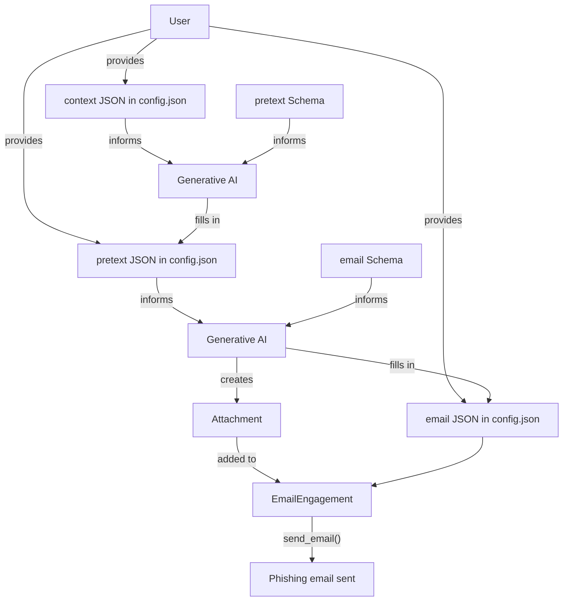

# ophishal

This project is intended for penetration tests and lab environments. Any other use is prohibited.

This project was completed during study for OSEP. It's intent is to provide a simple way to generate potent phishing emails leveraging generative AI. It doubles as an exercise in using GenAI both during development (scaffolding, test case generation, example generation) and for operational use cases. Read more about my experience with using OpenAI's project feature for development with GPT-4o and GPT-5 below.

## features

- Single configuration file
- Flexible use of GenAI, but not reliant upon it
- Templating for both email body and attachment using Jinja2
- Automatic MIMEType and file extension detection for attachment

## installation

This project relies on the [Poetry build system](https://python-poetry.org/docs/).

```bash
poetry install
poetry env activate
```

## development

```bash
poetry run pytest
poetry run ophishal -h
```

## design



## automatic attachment detection

This project uses `python-magic` and `mimetypes` to automatically determine the correct MIMEType and file extension for the attachment.

## using GenAI

1. Every generated line should be reviewed prior to a commit.
2. Write your own test cases. Using GenAI for scaffolding or text generation is great, but a real person needs to write or atomically review the test cases to make sure the project has good coverage. Additionally, I'm not saying it wasn't important before, but in using GenAI it is even more critical to maximize coverage to ensure everything is working as expected.
