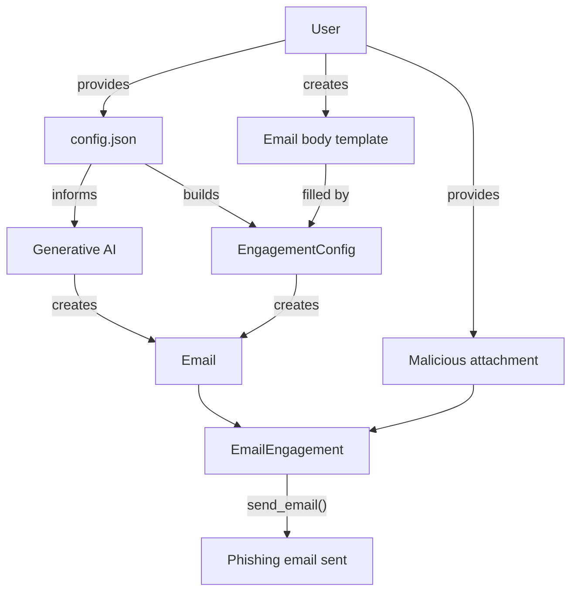

# ophishal

This project is intended for penetration tests and lab environments. Any other use is prohibited.

This project was completed during study for OSEP. It's intent is to provide a simple way to generate potent phishing emails leveraging generative AI. It doubles as an exercise in using GenAI both during development (scaffolding, test case generation, example generation) and for operational use cases. Read more about my experience with using OpenAI's project feature for development with GPT-4o and GPT-5 [below](#footnote-using-genai).

## Features

- Single configuration file
- Flexible use of GenAI, but not reliant upon it
- Templating for both email body and attachment using Jinja2
- Automatic MIMEType and file extension detection for attachment with `python-magic` and `mimetypes`
- CLI always overrides configuration file for on the fly changes

## Roadmap

Development is paused for the moment, but here are some things that should probably be done in the future.

1. Config file documentation
2. Smishing
3. GenAI creating attachments

## Installation

This project relies on the [Poetry build system](https://python-poetry.org/docs/).

In the source directory:

```bash
poetry build
```

In a python venv:

```bash
python3 -m venv venv
source venv/bin/activate
python3 -m pip install ./ophishal-0.1.0-py3-none-any.whl
python3 -m ophishal -h
```

## Development

```bash
poetry run ophishal -h
```

## Testing

```bash
poetry run pytest
```

## Design



# Example

Given the following `config.json`...

```json
{
  "campaign": "sptg-q3-finance-credential-harvest",

  "company": {
    "uid": "sptg",
    "official_name": "South Park Technology Group",
    "common_names": ["South Park Tech", "SPTG"],
    "abbreviations": ["SPTG"],
    "net_worth": "130k USD",
    "number_of_employees": 4,
    "type": "Private",
    "industry": "Media"
  },

  "departments": [
    {
      "uid": "eng",
      "name": "Engineering",
      "company_uid": "sptg",
      "email":"engineering@localhost",
      "head_uid": "emp_randy"
    }
  ],

  "employees": [
    {
      "uid": "emp_randy",
      "name": "Randy Marsh",
      "nickname": "Randy",
      "username": "rmarsh",
      "department_uid": "eng",
      "work_title": "Director of Engineering",
      "signature_block": "Randy Marsh | Director of Engineering",
      "email": "randy@localhost",
      "phone": "(303) 555-1001",
      "location": "South Park, CO",
      "reports_to": null,
      "writing_sample": [
        "I’m not chugging beer! I’m sampling a flight of gluten-free German lagers with a French wine pairing! It’s called a smorgaswein and it’s elegantly cultural!",
        "Just gonna get a little bit of cancer, Stan. Tell Mom it’s okay."
      ]
    },
    {
      "uid": "emp_stan",
      "name": "Stan Marsh",
      "nickname": "Stan",
      "username": "smarsh",
      "department_uid": "eng",
      "work_title": "Software Engineer I",
      "signature_block": "Stan Marsh | Software Engineer I",
      "email": null,
      "phone": null,
      "location": "South Park, CO",
      "reports_to": "emp_randy",
      "writing_sample":[
        "Dad, you like to drink. So have a drink once in a while. Have two. If you devote your whole life to completely avoiding something you like, then that thing still controls your life and you've never learned any discipline at all.",
        "Why’d you have to rub your cl*t on stage, dad?"
      ]
    }
  ],

  "sender": "emp_randy",
  "targets": ["emp_stan"],

  "context":{
    "culture": {
      "city":"South Park",
      "province":"Colorado",
      "country_code":"US"
    },
    "tech": [
      "Google Workspace",
      "Slack",
      "Zoom",
      "AWS",
      "Okta",
      "Jira",
      "CrowdStrike",
      "GitHub Enterprise"
    ],
    "current_events": [
      "Preparing for launch of 'SP MetaVerse' VR platform",
      "Internal phishing test scheduled next week",
      "Recent outage in South Park data center",
      "Hiring freeze announced in non-engineering departments"
    ]
  },

  "pretext":{
    "medium":"email",
    "pretext":"Download a docx and enable macros to view a graphic.",
    "desired_action": "download docx and enable macros",
    "constraints": [""]
  },

  "email":{
    "subject": "Action Required: Q3 Financials Access Expiration",
    "server":"192.168.1.25",
    "url":"http://callback"
  }
}
```

```
$ poetry run ophishal email --config /tmp/config.json --generate-body --url http://clicallback --output-body - --dryrun
[WARN][2025-08-21-19:03:05.552][ophishal:engagement.py:93][EmailEngagement:handle_attr] Overwriting CLI provided attribute (attr|old|new): url | http://callback | http://clicallback
[WARN][2025-08-21-19:03:05.552][ophishal:engagement.py:167][EmailEngagement:build] No template specified, body left empty
<!DOCTYPE html>
<html>
<head>
    <title>Action Required: Q3 Financials Access Expiration</title>
</head>
<body>
    <p>Hey Stan,</p>
    <p>Hope you're doing well! I've been diving into a mix of tasks here, but stumbled upon something important regarding our Q3 financials. It's all about staying sharp and proactive!</p>
    <p>We've got a document that needs your immediate attention. To ensure our team is prepared for the upcoming audit, we need you to download the attached file and enable the macros. Think of it as a quick sip of responsibility, keeping us ahead in the game!</p>
    <p><a href="http://clicallback">Access Document</a></p>
    <p>Let me know once you're through it. Consider it another adventure in the world of Engineering.</p>
    <p>Cheers,</p>
    <p>Randy</p>
</body>
</html>
```

Note that the CLI `--url` parameter was used instead of the configuration.

# Using GenAI

1. Every generated line should be reviewed prior to a commit.
2. Write your own test cases. Using GenAI for scaffolding or text generation is great, but a real person needs to write or atomically review the test cases to make sure the project has good coverage. Additionally, I'm not saying it wasn't important before, but in using GenAI it is even more critical to maximize coverage to ensure everything is working as expected.
3. The OpenAI APIs change frequently, so make sure you specify which version you are using when prompting about the `openai` library.
4. Overall, the experience wasn't great. I ended up abandoning GPT-5 (which, released during development, seemed noticably worse than GPT-4o) and writing almost everything by hand. The model struggled to maintain context and would often generate content that was not consistent with style, sytanx, or the overall design. That being said, it was great for example config generation and also did a pretty solid job with the actual email body generation.
