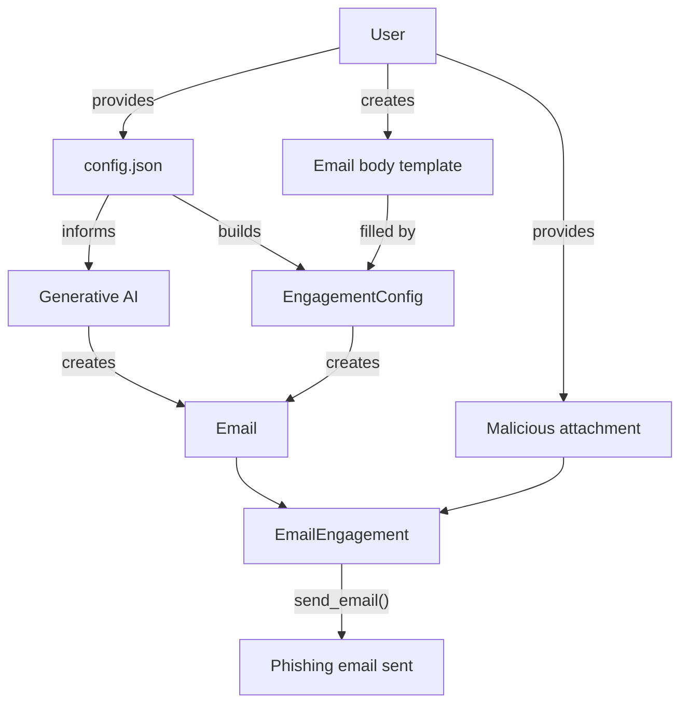

# ophishal

This project is intended for penetration tests and lab environments. Any other use is prohibited.

This project was completed during study for OSEP. It's intent is to provide a simple way to generate potent phishing emails leveraging generative AI. It doubles as an exercise in using GenAI both during development (scaffolding, test case generation, example generation) and for operational use cases. Read more about my experience with using OpenAI's project feature for development with GPT-4o and GPT-5 below.

## features

- Single configuration file
- Flexible use of GenAI, but not reliant upon it
- Templating for both email body and attachment using Jinja2
- Automatic MIMEType and file extension detection for attachment

## roadmap

1. Config file documentation
2. Smishing
3. GenAI creating attachments

## installation

This project relies on the [Poetry build system](https://python-poetry.org/docs/).

```bash
poetry install
poetry env activate
```

## development

```bash
poetry run pytest
poetry run ophishal -h
```

## design



## automatic attachment detection

This project uses `python-magic` and `mimetypes` to automatically determine the correct MIMEType and file extension for the attachment.

# example

Given the following `config.json`...

```json
{
  "campaign": "sptg-q3-finance-credential-harvest",

  "company": {
    "uid": "sptg",
    "official_name": "South Park Technology Group",
    "common_names": ["South Park Tech", "SPTG"],
    "abbreviations": ["SPTG"],
    "net_worth": "1.3B USD",
    "number_of_employees": 134,
    "type": "Private",
    "industry": "Media"
  },

  "departments": [
    {
      "uid": "eng",
      "name": "Engineering",
      "company_uid": "sptg",
      "email":"engineering@localhost",
      "head_uid": "emp_randy"
    }
  ],

  "employees": [
    {
      "uid": "emp_randy",
      "name": "Randy Marsh",
      "nickname": "Randy",
      "username": "rmarsh",
      "department_uid": "eng",
      "work_title": "Director of Engineering",
      "signature_block": "Randy Marsh | Director of Engineering",
      "email": "randy@localhost",
      "phone": "(303) 555-1001",
      "location": "South Park, CO",
      "reports_to": null,
      "sample_text": "Team—let’s keep it tight. Need a quick sync on the VR launch blockers today."
    },
    {
      "uid": "emp_stan",
      "name": "Stan Marsh",
      "nickname": "Stan",
      "username": "smarsh",
      "department_uid": "eng",
      "work_title": "Software Engineer I",
      "signature_block": "Stan Marsh | Software Engineer I",
      "email": null,
      "phone": null,
      "location": "South Park, CO",
      "reports_to": "emp_randy",
      "sample_text": "I can take a look after stand-up. If it’s urgent, ping me on Slack."
    }
  ],

  "sender": "emp_randy",
  "targets": ["emp_stan"],

  "context":{
    "culture": {
      "city":"South Park",
      "province":"Colorado",
      "country_code":"US",
      "workplace": "Casual"
    },
    "tech": [
      "Google Workspace",
      "Slack",
      "Zoom",
      "AWS",
      "Okta",
      "Jira",
      "CrowdStrike",
      "GitHub Enterprise"
    ],
    "current_events": [
      "Preparing for launch of 'SP MetaVerse' VR platform",
      "Internal phishing test scheduled next week",
      "Recent outage in South Park data center",
      "Hiring freeze announced in non-engineering departments"
    ]
  },

  "pretext":{
    "medium":"email",
    "pretext":"Randy wants to have a meeting in the next hour about the upcoming SP MetaVerse launch and wants people to read a docx read-ahead with macro-enabled graphics.",
    "desired_action": "download docx and enable macros",
    "constraints": ["no spoofing legal department"]
  },

  "email":{
    "server":"192.168.1.25",
    "url":"http://callback"
  }
}
```

```
$ python3 -m ophishal email --config config.json --generate-body --output-body - --dryrun
[WARN][2025-08-20-23:20:17.559][ophishal:engagement.py:167][EmailEngagement:build] No template specified, body left empty
<!DOCTYPE html>
<html lang="en">
<head>
    <meta charset="UTF-8">
    <meta name="viewport" content="width=device-width, initial-scale=1.0">
    <title>SP MetaVerse Launch</title>
</head>
<body>
    <p>Hey Stan,</p>
    <p>I hope this message finds you well. I'm coordinating a last-minute meeting to ensure our readiness for the upcoming SP MetaVerse launch. It's critical that everyone in the team is up to speed before we proceed.</p>
    <p>I've attached a document with the latest details and macro-enabled graphics that I’d like you to review before the meeting. Please download and read through it carefully so you can contribute effectively to our discussion.</p>
    <p><a href="http://callback" style="color: blue; text-decoration: underline;">Download Document</a></p>
    <p>Let’s aim for a brief sync within the next hour. If you have any questions in the meantime, feel free to reach out directly.</p>
    <p>Thanks,</p>
    <p>Randy Marsh<br>Director of Engineering<br>South Park Technology Group<br>Phone: (303) 555-1001<br>Email: <a href="mailto:randy@localhost">randy@localhost</a></p>
</body>
</html>
```

# footnote: using GenAI

1. Every generated line should be reviewed prior to a commit.
2. Write your own test cases. Using GenAI for scaffolding or text generation is great, but a real person needs to write or atomically review the test cases to make sure the project has good coverage. Additionally, I'm not saying it wasn't important before, but in using GenAI it is even more critical to maximize coverage to ensure everything is working as expected.
3. The OpenAI APIs change frequently, so make sure you specify which version you are using when prompting about the `openai` library.
