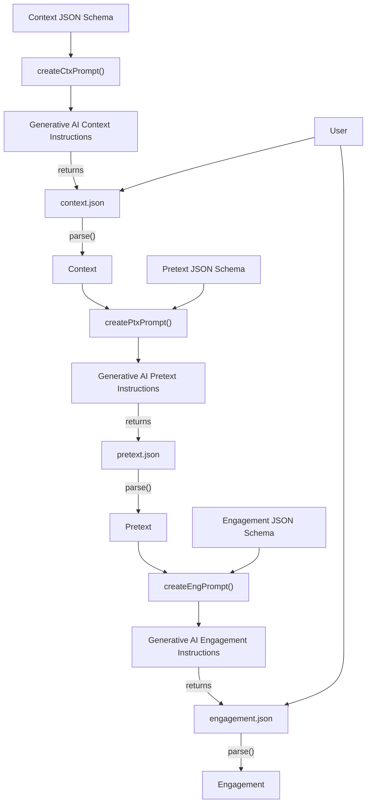

# Ophishal

This project is intended for penetration tests and lab environments. Any other use is prohibited.

This project was completed during study for the Offensive Security Experienced Penetration Tester (OSEP) certificate. It's intent is to provide a simple way to generate potent phishing emails leveraging modern technologies. It doubles as an exercise in using GenAI both during development (scaffolding, test case generation, example generation) and for operational use cases.

A phishing framework which takes a configuration file as input and, leveraging generative AI, builds a pretext, fills in a template, and sends an email to a target.

Alternatively, you can specify your own pretext configuration and use ophishal as a standard phishing framework instead of relying on GenAI.

## Installation

This project relies on the [Poetry build system](https://python-poetry.org/docs/).

```bash
poetry install
poetry env activate
```

## Design

